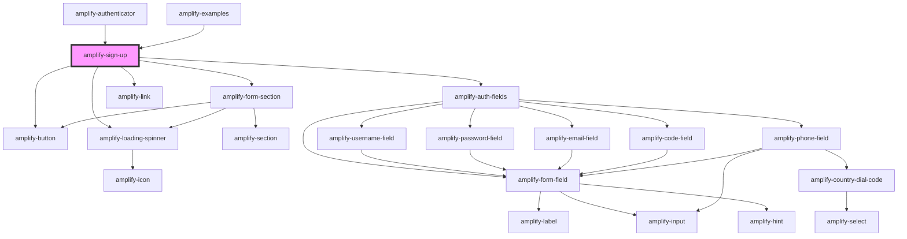

# amplify-sign-up

<!-- Auto Generated Below -->


## Properties

| Property                | Attribute            | Description                                                                                                                                                                                                                                                                                                                                                                                                                                                                                                                                                                       | Type                                                | Default                                                                                                                                                                                                                                                                                                                                                                                                                                                                                                                                                                                                                                                                                                                                               |
| ----------------------- | -------------------- | --------------------------------------------------------------------------------------------------------------------------------------------------------------------------------------------------------------------------------------------------------------------------------------------------------------------------------------------------------------------------------------------------------------------------------------------------------------------------------------------------------------------------------------------------------------------------------- | --------------------------------------------------- | ----------------------------------------------------------------------------------------------------------------------------------------------------------------------------------------------------------------------------------------------------------------------------------------------------------------------------------------------------------------------------------------------------------------------------------------------------------------------------------------------------------------------------------------------------------------------------------------------------------------------------------------------------------------------------------------------------------------------------------------------------- |
| `formFields`            | --                   | Form fields allows you to utilize our pre-built components such as username field, code field, password field, email field, etc. by passing an array of strings that you would like the order of the form to be in. If you need more customization, such as changing text for a label or adjust a placeholder, you can follow the structure below in order to do just that. ``` [   {     type: 'username'\|'password'\|'email'\|'code'\|'default',     label: string,     placeholder: string,     hint: string \| Functional Component \| null,     required: boolean   } ] ``` | `FormFieldTypes \| string[]`                        | `[     {       type: 'username',       placeholder: SIGN_UP_USERNAME_PLACEHOLDER,       required: true,       handleInputChange: event => this.handleUsernameChange(event),     },     {       type: 'password',       placeholder: SIGN_UP_PASSWORD_PLACEHOLDER,       required: true,       handleInputChange: event => this.handlePasswordChange(event),     },     {       type: 'email',       placeholder: SIGN_UP_EMAIL_PLACEHOLDER,       required: true,       handleInputChange: event => this.handleEmailChange(event),     },     {       type: 'phone',       required: true,       handleInputChange: event => this.handlePhoneNumberChange(event),       inputProps: {         'data-test': 'phone-number-input',       },     },   ]` |
| `handleAuthStateChange` | --                   | Passed from the Authenticator component in order to change Authentication state e.g. SignIn -> 'Create Account' link -> SignUp                                                                                                                                                                                                                                                                                                                                                                                                                                                    | `(nextAuthState: AuthState, data?: object) => void` | `dispatchAuthStateChangeEvent`                                                                                                                                                                                                                                                                                                                                                                                                                                                                                                                                                                                                                                                                                                                        |
| `handleSubmit`          | --                   | Fires when sign up form is submitted                                                                                                                                                                                                                                                                                                                                                                                                                                                                                                                                              | `(event: Event) => void`                            | `event => this.signUp(event)`                                                                                                                                                                                                                                                                                                                                                                                                                                                                                                                                                                                                                                                                                                                         |
| `haveAccountText`       | `have-account-text`  | Used for the submit button text in sign up component                                                                                                                                                                                                                                                                                                                                                                                                                                                                                                                              | `string`                                            | `HAVE_ACCOUNT_TEXT`                                                                                                                                                                                                                                                                                                                                                                                                                                                                                                                                                                                                                                                                                                                                   |
| `headerText`            | `header-text`        | Used for header text in sign up component                                                                                                                                                                                                                                                                                                                                                                                                                                                                                                                                         | `string`                                            | `SIGN_UP_HEADER_TEXT`                                                                                                                                                                                                                                                                                                                                                                                                                                                                                                                                                                                                                                                                                                                                 |
| `signInText`            | `sign-in-text`       | Used for the submit button text in sign up component                                                                                                                                                                                                                                                                                                                                                                                                                                                                                                                              | `string`                                            | `SIGN_IN_TEXT`                                                                                                                                                                                                                                                                                                                                                                                                                                                                                                                                                                                                                                                                                                                                        |
| `submitButtonText`      | `submit-button-text` | Used for the submit button text in sign up component                                                                                                                                                                                                                                                                                                                                                                                                                                                                                                                              | `string`                                            | `SIGN_UP_SUBMIT_BUTTON_TEXT`                                                                                                                                                                                                                                                                                                                                                                                                                                                                                                                                                                                                                                                                                                                          |
| `validationErrors`      | `validation-errors`  | Engages when invalid actions occur, such as missing field, etc.                                                                                                                                                                                                                                                                                                                                                                                                                                                                                                                   | `string`                                            | `undefined`                                                                                                                                                                                                                                                                                                                                                                                                                                                                                                                                                                                                                                                                                                                                           |


## Dependencies

### Used by

 - [amplify-authenticator](../amplify-authenticator)
 - [amplify-examples](../amplify-examples)

### Depends on

- [amplify-form-section](../amplify-form-section)
- [amplify-auth-fields](../amplify-auth-fields)
- [amplify-link](../amplify-link)
- [amplify-button](../amplify-button)
- [amplify-loading-spinner](../amplify-loading-spinner)

### Graph


----------------------------------------------

*Built with [StencilJS](https://stenciljs.com/)*
