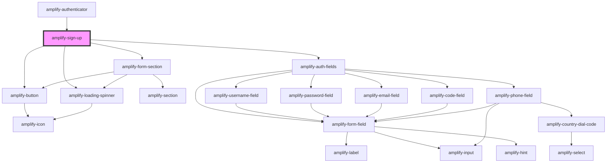

# amplify-sign-up

<!-- Auto Generated Below -->


## Properties

| Property                | Attribute            | Description                                                                                                                                                                                                                                                                                                                                                                                                                                                                                                                           | Type                                                | Default                                   |
| ----------------------- | -------------------- | ------------------------------------------------------------------------------------------------------------------------------------------------------------------------------------------------------------------------------------------------------------------------------------------------------------------------------------------------------------------------------------------------------------------------------------------------------------------------------------------------------------------------------------- | --------------------------------------------------- | ----------------------------------------- |
| `formFields`            | --                   | Form fields allows you to utilize our pre-built components such as username field, code field, password field, email field, etc. by passing an array of strings that you would like the order of the form to be in. If you need more customization, such as changing text for a label or adjust a placeholder, you can follow the structure below in order to do just that. ``` [   {     type: string,     label: string,     placeholder: string,     hint: string \| Functional Component \| null,     required: boolean   } ] ``` | `FormFieldTypes \| string[]`                        | `[]`                                      |
| `handleAuthStateChange` | --                   | Auth state change handler for this component e.g. SignIn -> 'Create Account' link -> SignUp                                                                                                                                                                                                                                                                                                                                                                                                                                           | `(nextAuthState: AuthState, data?: object) => void` | `dispatchAuthStateChangeEvent`            |
| `handleSignUp`          | --                   | Override for handling the Auth.SignUp API call                                                                                                                                                                                                                                                                                                                                                                                                                                                                                        | `(params: SignUpParams) => Promise<ISignUpResult>`  | `params => this.authSignUp(params)`       |
| `handleSubmit`          | --                   | Fires when sign up form is submitted                                                                                                                                                                                                                                                                                                                                                                                                                                                                                                  | `(event: Event) => void`                            | `event => this.signUp(event)`             |
| `haveAccountText`       | `have-account-text`  | Used for the submit button text in sign up component                                                                                                                                                                                                                                                                                                                                                                                                                                                                                  | `string`                                            | `Translations.SIGN_UP_HAVE_ACCOUNT_TEXT`  |
| `headerText`            | `header-text`        | Used for header text in sign up component                                                                                                                                                                                                                                                                                                                                                                                                                                                                                             | `string`                                            | `Translations.SIGN_UP_HEADER_TEXT`        |
| `signInText`            | `sign-in-text`       | Text used for the sign in hyperlink                                                                                                                                                                                                                                                                                                                                                                                                                                                                                                   | `string`                                            | `Translations.SIGN_IN_TEXT`               |
| `submitButtonText`      | `submit-button-text` | Used for the submit button text in sign up component                                                                                                                                                                                                                                                                                                                                                                                                                                                                                  | `string`                                            | `Translations.SIGN_UP_SUBMIT_BUTTON_TEXT` |
| `usernameAlias`         | `username-alias`     | Username Alias is used to setup authentication with `username`, `email` or `phone_number`                                                                                                                                                                                                                                                                                                                                                                                                                                             | `"email" \| "phone_number" \| "username"`           | `'username'`                              |
| `validationErrors`      | `validation-errors`  | Engages when invalid actions occur, such as missing field, etc.                                                                                                                                                                                                                                                                                                                                                                                                                                                                       | `string`                                            | `undefined`                               |


## Slots

| Slot                         | Description                                    |
| ---------------------------- | ---------------------------------------------- |
| `"footer"`                   | Content placed in the footer of the component  |
| `"header-subtitle"`          | Subtitle content placed below header text      |
| `"primary-footer-content"`   | Content placed on the right side of the footer |
| `"secondary-footer-content"` | Content placed on the left side of the footer  |


## CSS Custom Properties

| Name                   | Description               |
| ---------------------- | ------------------------- |
| `--footer-color`       | Font color of the footer  |
| `--footer-font-family` | Font family of the footer |
| `--footer-font-size`   | Font size of the footer   |
| `--footer-weight`      | Font weight of the footer |


## Dependencies

### Used by

 - [amplify-authenticator](../amplify-authenticator)

### Depends on

- [amplify-form-section](../amplify-form-section)
- [amplify-auth-fields](../amplify-auth-fields)
- [amplify-button](../amplify-button)
- [amplify-loading-spinner](../amplify-loading-spinner)

### Graph


----------------------------------------------

*Built with [StencilJS](https://stenciljs.com/)*
