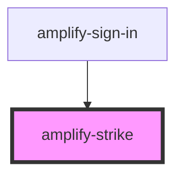

# amplify-strike

<!-- Auto Generated Below -->

## Slots

| Slot          | Description                                     |
| ------------- | ----------------------------------------------- |
| `"(default)"` | Content placed between the two horizontal rules |

## CSS Custom Properties

| Name                   | Description                                                           |
| ---------------------- | --------------------------------------------------------------------- |
| `--border-color`       | Color of the horizontal rules                                         |
| `--color`              | Text color of the content placed between the horizontal rules         |
| `--content-background` | Background color of the container placed between the horizontal rules |

## Dependencies

### Used by

 - [amplify-sign-in](../amplify-sign-in)

### Graph

----------------------------------------------

*Built with [StencilJS](https://stenciljs.com/)*
