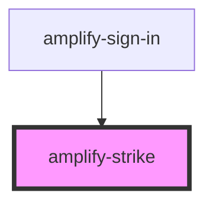

# amplify-strike

<!-- Auto Generated Below -->

## Properties

| Property        | Attribute        | Description                         | Type      | Default |
| --------------- | ---------------- | ----------------------------------- | --------- | ------- |
| `overrideStyle` | `override-style` | (Optional) Override default styling | `boolean` | `false` |

## Dependencies

### Used by

 - [amplify-sign-in](../amplify-sign-in)

### Graph

----------------------------------------------

*Built with [StencilJS](https://stenciljs.com/)*
