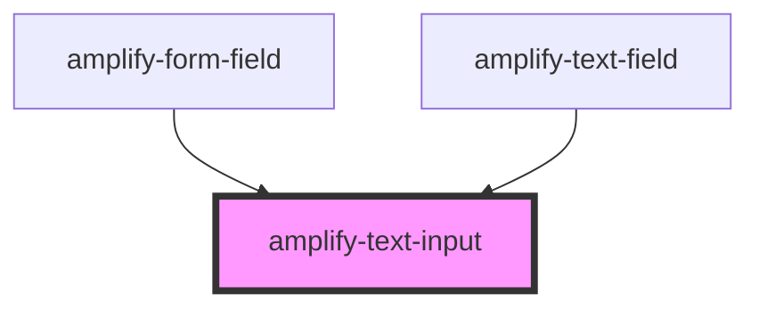

# amplify-text-input

<!-- Auto Generated Below -->

## Properties

| Property      | Attribute     | Description | Type                                                 | Default     |
| ------------- | ------------- | ----------- | ---------------------------------------------------- | ----------- |
| `description` | `description` |             | `string`                                             | `undefined` |
| `fieldId`     | `field-id`    |             | `string`                                             | `undefined` |
| `inputProps`  | --            |             | `{ type?: string; onInput?: (Event: any) => void; }` | `{}`        |
| `label`       | `label`       |             | `string`                                             | `undefined` |

## Dependencies

### Used by

 - [amplify-form-field](../amplify-form-field)
 - [amplify-text-field](../amplify-text-field)

### Graph

----------------------------------------------

*Built with [StencilJS](https://stenciljs.com/)*
