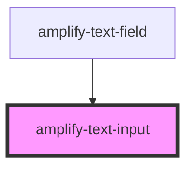

# amplify-text-input

<!-- Auto Generated Below -->

## Properties

| Property        | Attribute        | Description | Type                                                                       | Default     |
| --------------- | ---------------- | ----------- | -------------------------------------------------------------------------- | ----------- |
| `fieldId`       | `field-id`       |             | `string`                                                                   | `undefined` |
| `inputProps`    | --               |             | `{ placeholder?: string; type?: string; onInput?: (Event: any) => void; }` | `{}`        |
| `styleOverride` | `style-override` |             | `boolean`                                                                  | `false`     |

## Dependencies

### Used by

 - [amplify-text-field](../amplify-text-field)

### Graph

----------------------------------------------

*Built with [StencilJS](https://stenciljs.com/)*
