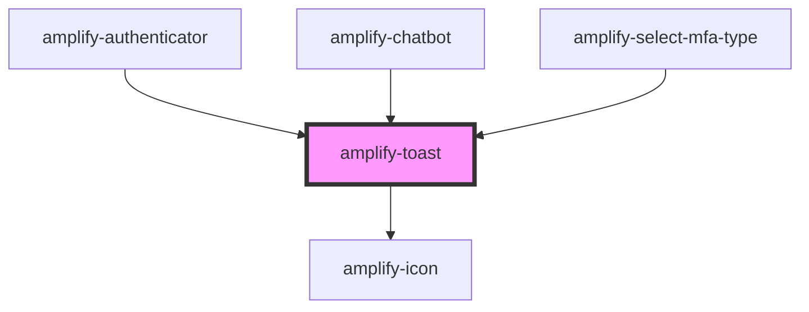

# amplify-toast

<!-- Auto Generated Below -->

## Properties

| Property      | Attribute | Description                                                    | Type         | Default     |
| ------------- | --------- | -------------------------------------------------------------- | ------------ | ----------- |
| `handleClose` | --        | Used in order to add a dismissable `x` for the Toast component | `() => void` | `undefined` |
| `message`     | `message` | Message to be displayed inside the toast                       | `string`     | `''`        |

## Slots

| Slot          | Description                                                                                                                           |
| ------------- | ------------------------------------------------------------------------------------------------------------------------------------- |
| `"(default)"` | Content placed inside the toast. If `message` prop is already set, then this content will be displayed to the right of the `message`. |

## CSS Custom Properties

| Name                 | Description                                |
| -------------------- | ------------------------------------------ |
| `--background-color` | Background color of the container          |
| `--close-icon-color` | Fill color of the close icon               |
| `--close-icon-hover` | Fill color of the close icon when hovering |
| `--color`            | Text color within the toast                |
| `--font-size`        | Font size of the text within the toast     |

## Dependencies

### Used by

 - [amplify-authenticator](../amplify-authenticator)
 - [amplify-chatbot](../amplify-chatbot)
 - [amplify-select-mfa-type](../amplify-select-mfa-type)

### Depends on

- [amplify-icon](../amplify-icon)

### Graph

----------------------------------------------

*Built with [StencilJS](https://stenciljs.com/)*
