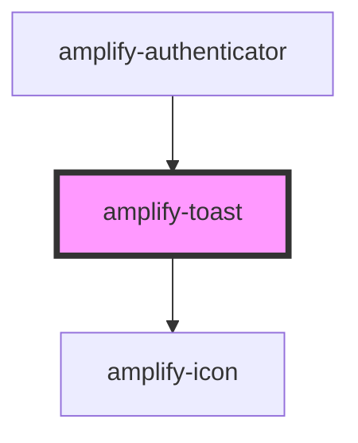

# amplify-toast

<!-- Auto Generated Below -->

## Properties

| Property      | Attribute | Description                                                    | Type         | Default     |
| ------------- | --------- | -------------------------------------------------------------- | ------------ | ----------- |
| `handleClose` | --        | Used in order to add a dismissable `x` for the Toast component | `() => void` | `undefined` |
| `message`     | `message` |                                                                | `string`     | `''`        |

## Dependencies

### Used by

 - [amplify-authenticator](../amplify-authenticator)

### Depends on

- [amplify-icon](../amplify-icon)

### Graph

----------------------------------------------

*Built with [StencilJS](https://stenciljs.com/)*
