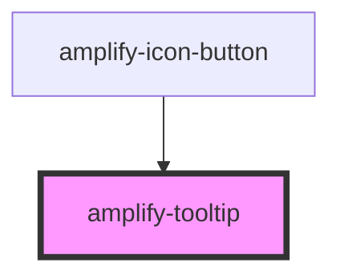

# amplify-tooltip

<!-- Auto Generated Below -->

## Properties

| Property         | Attribute          | Description                                                                                              | Type      | Default     |
| ---------------- | ------------------ | -------------------------------------------------------------------------------------------------------- | --------- | ----------- |
| `overrideStyle`  | `override-style`   | (Optional) Override default styling                                                                      | `boolean` | `false`     |
| `shouldAutoShow` | `should-auto-show` | (Optional) Whether or not the tooltip should be automatically shown, i.e. not disappear when not hovered | `boolean` | `false`     |
| `text`           | `text`             | (Required) The text in the tooltip                                                                       | `string`  | `undefined` |

## Dependencies

### Used by

 - [amplify-icon-button](../amplify-icon-button)

### Graph

----------------------------------------------

*Built with [StencilJS](https://stenciljs.com/)*
