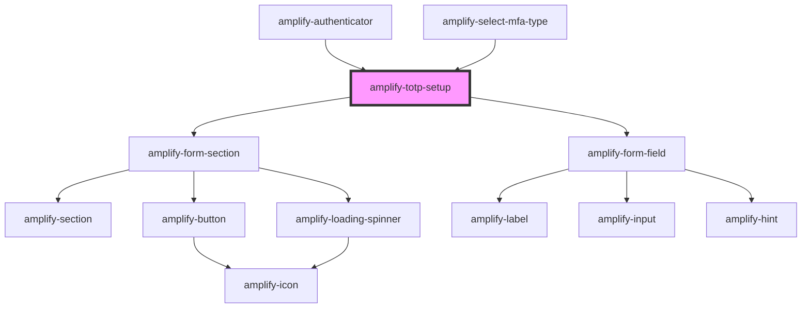

# amplify-totp

<!-- Auto Generated Below -->

## Properties

| Property                | Attribute     | Description                                                                                     | Type                                                    | Default                         |
| ----------------------- | ------------- | ----------------------------------------------------------------------------------------------- | ------------------------------------------------------- | ------------------------------- |
| `handleAuthStateChange` | --            | Auth state change handler for this component                                                    | `(nextAuthState: AuthState, data?: object) => void`     | `dispatchAuthStateChangeEvent`  |
| `handleComplete`        | --            | This is run after totp setup is complete. Useful if using this as standalone.                   | `(user: CognitoUserInterface) => void \| Promise<void>` | `this.onTOTPEvent`              |
| `headerText`            | `header-text` | Used for header text in totp setup component                                                    | `string`                                                | `Translations.TOTP_HEADER_TEXT` |
| `issuer`                | `issuer`      | Used for customizing the issuer string in the qr code image                                     | `string`                                                | `Translations.TOTP_ISSUER`      |
| `standalone`            | `standalone`  | Set this to true if this component is running outside the default `amplify-authenticator` usage | `boolean`                                               | `false`                         |
| `user`                  | --            | Used in order to configure TOTP for a user                                                      | `CognitoUserInterface`                                  | `undefined`                     |

## Dependencies

### Used by

 - [amplify-authenticator](../amplify-authenticator)
 - [amplify-select-mfa-type](../amplify-select-mfa-type)

### Depends on

- [amplify-form-section](../amplify-form-section)
- [amplify-form-field](../amplify-form-field)

### Graph

----------------------------------------------

*Built with [StencilJS](https://stenciljs.com/)*
