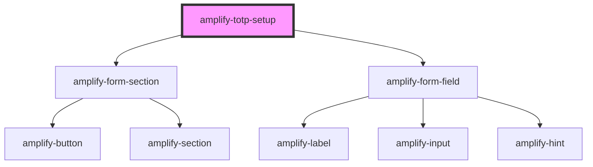

# amplify-totp

<!-- Auto Generated Below -->

## Properties

| Property                | Attribute | Description                                                                     | Type                                                                   | Default                      |
| ----------------------- | --------- | ------------------------------------------------------------------------------- | ---------------------------------------------------------------------- | ---------------------------- |
| `handleAuthStateChange` | --        | Passed from the Authenticator component in order to change Authentication state | `(nextAuthState: AuthState, data?: object) => void`                    | `undefined`                  |
| `inputProps`            | --        | Used to set autoFocus to true when TOTP Component has loaded                    | `object`                                                               | `{     autoFocus: true,   }` |
| `onTOTPEvent`           | --        | Triggers an TOTP Event after handleSubmit method has been called                | `(event: "SETUP_TOTP", data: any, user: CognitoUserInterface) => void` | `undefined`                  |
| `user`                  | --        | Used in order to configure TOTP for a user                                      | `CognitoUserInterface`                                                 | `null`                       |

## Dependencies

### Depends on

- [amplify-form-section](../amplify-form-section)
- [amplify-form-field](../amplify-form-field)

### Graph

----------------------------------------------

*Built with [StencilJS](https://stenciljs.com/)*
