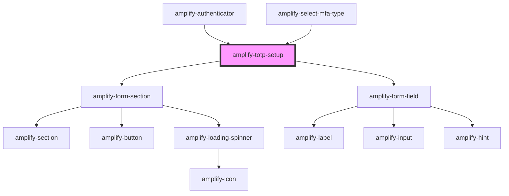

# amplify-totp

<!-- Auto Generated Below -->

## Properties

| Property                | Attribute     | Description                                  | Type                                                | Default                                   |
| ----------------------- | ------------- | -------------------------------------------- | --------------------------------------------------- | ----------------------------------------- |
| `handleAuthStateChange` | --            | Auth state change handler for this component | `(nextAuthState: AuthState, data?: object) => void` | `dispatchAuthStateChangeEvent`            |
| `headerText`            | `header-text` | Used for header text in totp setup component | `string`                                            | `I18n.get(Translations.TOTP_HEADER_TEXT)` |
| `user`                  | --            | Used in order to configure TOTP for a user   | `CognitoUserInterface`                              | `undefined`                               |

## Dependencies

### Used by

 - [amplify-authenticator](../amplify-authenticator)
 - [amplify-select-mfa-type](../amplify-select-mfa-type)

### Depends on

- [amplify-form-section](../amplify-form-section)
- [amplify-form-field](../amplify-form-field)

### Graph

----------------------------------------------

*Built with [StencilJS](https://stenciljs.com/)*
