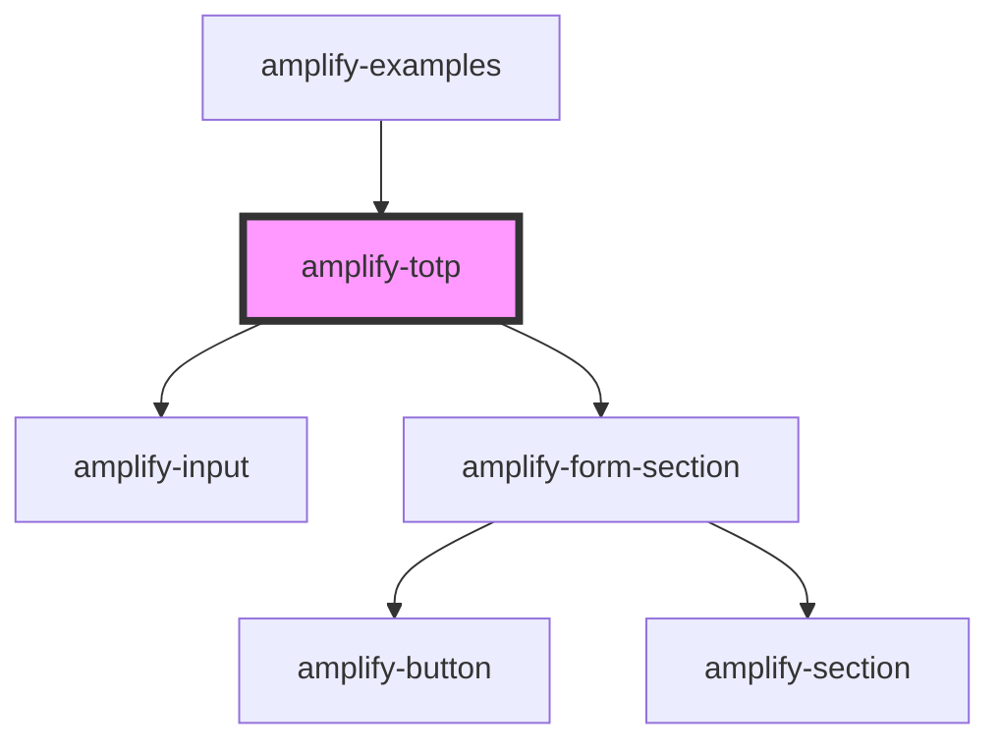

# amplify-totp

<!-- Auto Generated Below -->

## Properties

| Property   | Attribute | Description | Type                   | Default     |
| ---------- | --------- | ----------- | ---------------------- | ----------- |
| `MFATypes` | --        |             | `MFATOTPOptions`       | `undefined` |
| `authData` | --        |             | `CognitoUserInterface` | `null`      |

## Dependencies

### Used by

 - [amplify-examples](../amplify-examples)

### Depends on

- [amplify-input](../amplify-input)
- [amplify-form-section](../amplify-form-section)

### Graph

----------------------------------------------

*Built with [StencilJS](https://stenciljs.com/)*
