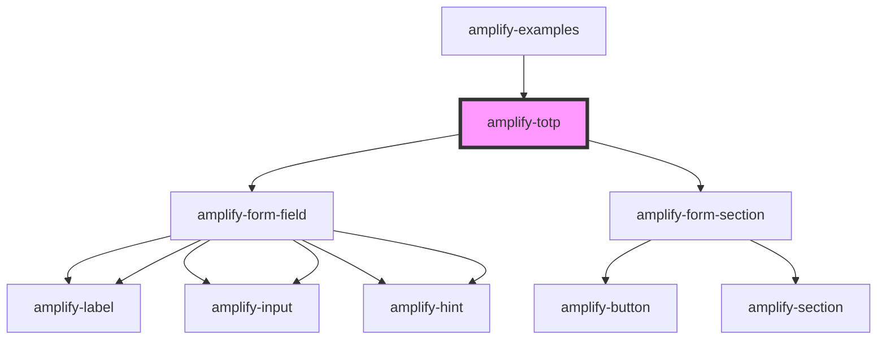

# amplify-totp

<!-- Auto Generated Below -->

## Properties

| Property      | Attribute | Description | Type                                                                   | Default                |
| ------------- | --------- | ----------- | ---------------------------------------------------------------------- | ---------------------- |
| `authData`    | --        |             | `CognitoUserInterface`                                                 | `null`                 |
| `inputProps`  | --        |             | `object`                                                               | `{ autoFocus: true, }` |
| `onTOTPEvent` | --        |             | `(event: "SETUP_TOTP", data: any, user: CognitoUserInterface) => void` | `undefined`            |

## Dependencies

### Used by

- [amplify-examples](../amplify-examples)

### Depends on

- [amplify-form-field](../amplify-form-field)
- [amplify-form-section](../amplify-form-section)
- [amplify-form-field](../amplify-form-field)

### Graph

---

_Built with [StencilJS](https://stenciljs.com/)_
