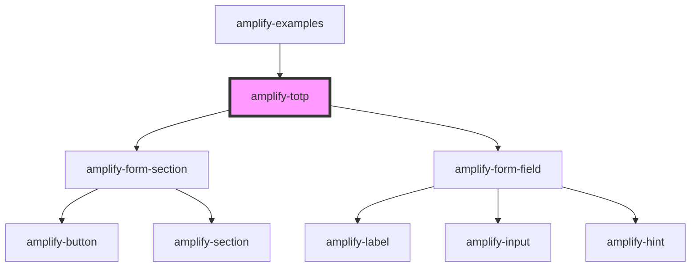

# amplify-totp

<!-- Auto Generated Below -->

## Properties

| Property      | Attribute | Description                                                      | Type                                                                   | Default                      |
| ------------- | --------- | ---------------------------------------------------------------- | ---------------------------------------------------------------------- | ---------------------------- |
| `authData`    | --        | Used in order to configure TOTP for a user                       | `CognitoUserInterface`                                                 | `null`                       |
| `inputProps`  | --        | Used to set autoFocus to true when TOTP Component has loaded     | `object`                                                               | `{     autoFocus: true,   }` |
| `onTOTPEvent` | --        | Triggers an TOTP Event after handleSubmit method has been called | `(event: "SETUP_TOTP", data: any, user: CognitoUserInterface) => void` | `undefined`                  |

## Dependencies

### Used by

 - [amplify-examples](../amplify-examples)

### Depends on

- [amplify-form-section](../amplify-form-section)
- [amplify-form-field](../amplify-form-field)

### Graph

----------------------------------------------

*Built with [StencilJS](https://stenciljs.com/)*
