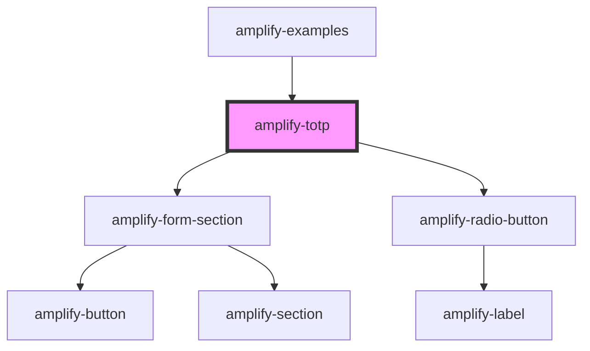

# amplify-totp

<!-- Auto Generated Below -->

## Properties

| Property   | Attribute | Description                                                            | Type                   | Default     |
| ---------- | --------- | ---------------------------------------------------------------------- | ---------------------- | ----------- |
| `MFATypes` | --        | Types of MFA options                                                   | `MFATOTPOptions`       | `undefined` |
| `authData` | --        | Current authenticated user in order to sign requests properly for TOTP | `CognitoUserInterface` | `null`      |

## Dependencies

### Used by

 - [amplify-examples](../amplify-examples)

### Depends on

- [amplify-form-section](../amplify-form-section)
- [amplify-radio-button](../amplify-radio-button)

### Graph

----------------------------------------------

*Built with [StencilJS](https://stenciljs.com/)*
