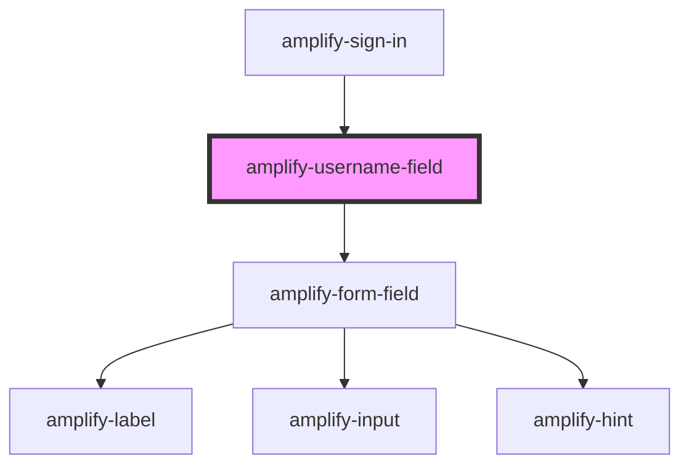

# amplify-username-field

<!-- Auto Generated Below -->

## Properties

| Property                   | Attribute                    | Description                                                             | Type                                    | Default                |
| -------------------------- | ---------------------------- | ----------------------------------------------------------------------- | --------------------------------------- | ---------------------- |
| `fieldIdText`              | `field-id-text`              | Based on the type of field e.g. sign in, sign up, forgot password, etc. | `"password" \| "sign-in" \| "username"` | `undefined`            |
| `usernameLabel`            | `username-label`             | Used for the username label                                             | `string`                                | `USERNAME_LABEL`       |
| `usernamePlaceholderLabel` | `username-placeholder-label` | Used for the placeholder label                                          | `string`                                | `USERNAME_PLACEHOLDER` |

## Dependencies

### Used by

 - [amplify-sign-in](../amplify-sign-in)

### Depends on

- [amplify-form-field](../amplify-form-field)

### Graph

----------------------------------------------

*Built with [StencilJS](https://stenciljs.com/)*
