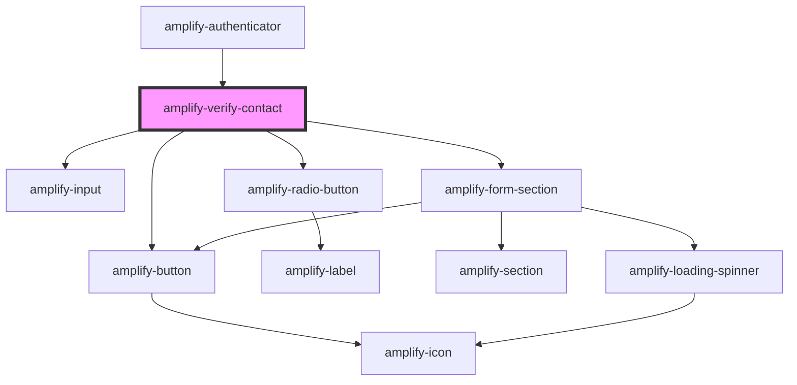

# amplify-verify-contact

<!-- Auto Generated Below -->

## Properties

| Property                | Attribute | Description                              | Type                                                | Default                        |
| ----------------------- | --------- | ---------------------------------------- | --------------------------------------------------- | ------------------------------ |
| `handleAuthStateChange` | --        | Authentication state handler             | `(nextAuthState: AuthState, data?: object) => void` | `dispatchAuthStateChangeEvent` |
| `user`                  | --        | User with unverified contact information | `CognitoUserInterface`                              | `undefined`                    |

## Dependencies

### Used by

 - [amplify-authenticator](../amplify-authenticator)

### Depends on

- [amplify-input](../amplify-input)
- [amplify-radio-button](../amplify-radio-button)
- [amplify-form-section](../amplify-form-section)
- [amplify-button](../amplify-button)

### Graph

----------------------------------------------

*Built with [StencilJS](https://stenciljs.com/)*
