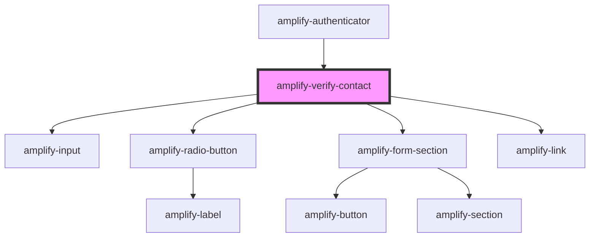

# amplify-verify-contact

<!-- Auto Generated Below -->

## Properties

| Property                | Attribute        | Description                                                                     | Type                                                | Default     |
| ----------------------- | ---------------- | ------------------------------------------------------------------------------- | --------------------------------------------------- | ----------- |
| `handleAuthStateChange` | --               | Passed from the Authenticator component in order to change Authentication state | `(nextAuthState: AuthState, data?: object) => void` | `undefined` |
| `overrideStyle`         | `override-style` | (Optional) Override default styling                                             | `boolean`                                           | `false`     |
| `user`                  | --               | Used for the username to be passed to resend code                               | `CognitoUserInterface`                              | `undefined` |

## Dependencies

### Used by

 - [amplify-authenticator](../amplify-authenticator)

### Depends on

- [amplify-input](../amplify-input)
- [amplify-radio-button](../amplify-radio-button)
- [amplify-form-section](../amplify-form-section)
- [amplify-link](../amplify-link)

### Graph

----------------------------------------------

*Built with [StencilJS](https://stenciljs.com/)*
