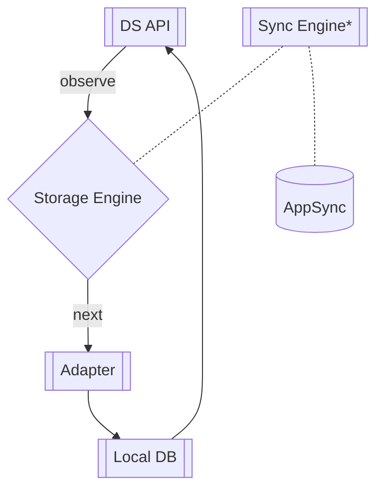
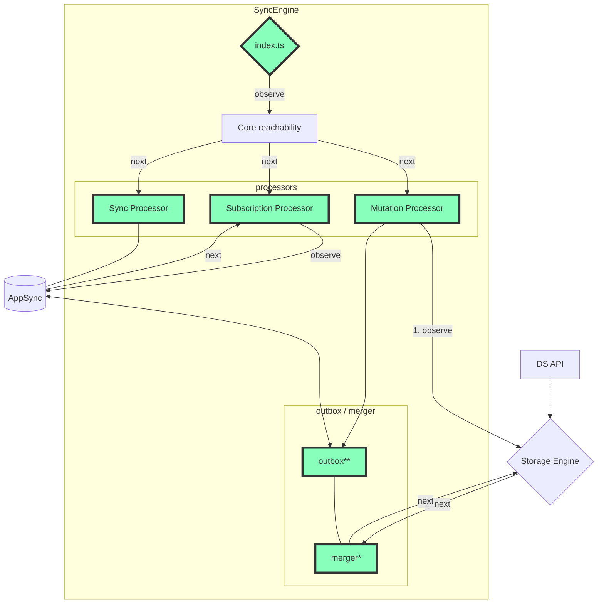

# AWS Amplify DataStore Docs

[Amplify DataStore](https://docs.amplify.aws/lib/datastore/getting-started/q/platform/js/) provides a programming model for leveraging shared and distributed data without writing additional code for offline and online scenarios, which makes working with distributed, cross-user data just as simple as working with local-only data.

---

| package                | version                                                         | open issues                                                                                                                                                                                  | closed issues                                                                                                                                                                                 |
| ---------------------- | --------------------------------------------------------------- | -------------------------------------------------------------------------------------------------------------------------------------------------------------------------------------------- | --------------------------------------------------------------------------------------------------------------------------------------------------------------------------------------------- |
| @aws-amplify/datastore |  |  |  |

---

## **👋 Note For Contributers: 👋**

_**Please update these docs any time you find something that is incorrect or lacking. In particular, if a line in the docs prompts a question, take a moment to figure out the answer, then update the docs with the necessary detail.**_

---

## Getting Started

Before you start reading through these docs, take a moment to understand [how DataStore works at a high level](https://docs.amplify.aws/lib/datastore/how-it-works/q/platform/js/). Additionally, we recommend first reading through [docs.amplify.aws](https://docs.amplify.aws/lib/datastore/getting-started/q/platform/js/). The purpose of these docs is to dive deep into the codebase itself and understand the inner workings of DataStore for the purpose of contributing. Understanding these docs is **not** necessary for using DataStore. Lastly, before reading, take a look at [the diagrams below](#diagrams).

---

## Docs

- [Conflict Resolution](docs/conflict-resolution.md)
- [Contributing](docs/contributing.md)
- [DataStore Lifecycle Events ("Start", "Stop", "Clear")](docs/datastore-lifecycle-events.md)
  - This explains how DataStore fundementally works, and is a great place to start.
- [Getting Started](docs/getting-started.md) (Running against a sample app, etc.)
- [Namespaces](docs/namespaces.md)
- [How DataStore uses Observables](docs/observables.md)
- [Schema Changes](docs/schema-changes.md)
- [Storage](docs/storage.md)
- [Sync Engine](docs/sync-engine.md)
- ["Unsupported hacks" / workarounds](docs/workarounds.md)

---

# Diagrams

_Note: relationships with dotted lines are explained more in a separate diagram._

## How the DataStore API and Storage Engine Interact

# How the Sync Engine Observes Changes in Storage and AppSync

_Note: All green nodes belong to the Sync Engine._

\* Merger first checks outbox

\*\* Outbox sends outgoing messages to AppSync

---

# Project Structure

<pre>
amplify-js/packages/datastore/src
├── authModeStrategies
│   └── defaultAuthStraegy.ts
│   └── index.ts
│   └── multiAuthStrategy.ts
├── datastore
│   └── datastore.ts # Entry point for DataStore
├── predicates
│   └── index.ts
│   └── sort.ts
├── ssr
├── storage # Storage Engine
│   └── adapter # Platform-specific Storage Adapters
│      └── getDefaultAdapter
│      └── AsyncStorageAdapter.ts
│      └── AsyncStorageDatabase.ts
│      └── index.ts
│      └── IndexedDBAdapter.ts
│      └── InMemoryStore.native.ts
│      └── InMemoryStore.ts
│   └── storage.ts # Entry point for Storage
├── sync # Sync Engine
│   └── dataStoreReachability
│      └── index.native.ts
│      └── index.ts
│   └── processors # Sync Engine Processors
│      └── mutation.ts
│      └── subscription.ts
│      └── sync.ts
│   └── datastoreConnectivity.ts # Subscribe to reachability monitor
│   └── index.ts # Entry point for Sync Engine
│   └── merger.ts # <a href="https://github.com/aws-amplify/amplify-js/blob/datastore-docs/packages/datastore/docs/sync-engine.md#merger" title="merger doc">doc</a>
│   └── outbox.ts # <a href="https://github.com/aws-amplify/amplify-js/blob/datastore-docs/packages/datastore/docs/sync-engine.md#outbox" title="outbox doc">doc</a>
</pre>

---

## Other Resources:

- [High-level overview of how DataStore works](https://docs.amplify.aws/lib/datastore/how-it-works/q/platform/js/)
- [DataStore Docs](https://docs.amplify.aws/lib/datastore/getting-started/q/platform/js/)
- [re:Invent talk](https://www.youtube.com/watch?v=KcYl6_We0EU)
