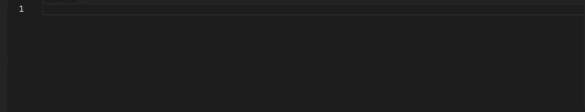

# AWS Amplify VS Code Extension

Code snippets and completion for the [AWS Amplify](https://aws.github.io/aws-amplify) API.

## Installation

Go to the Extension Marketplace in VS Code and search for AWS Amplify API. 
Click install on the extension with title "AWS Amplify API", description "AWS Amplify API code snippets", and publisher "Tommy Praeger".

## Usage

In a JavaScript or JSX file*, start typing an AWS Amplify API command that has a corresponding snippet and choose the appropriate snippet by either clicking it or pressing "enter" or "tab" when the correct snippet is highlighted in the dropdown menu. You can scroll between snippets using the up and down arrow keys.

The snippets options that pop up are based on the prefix that you type. For the complete set of prefix/snippet pairings for AWS Amplify, see the documentation:

Full code blocks from the documentation guides: https://github.com/tommypraeger/aws-amplify-tools-vscode/wiki/Full-Code-Block-Snippets

Selected code segments from the documentation guides, broken down by documentation page: https://github.com/tommypraeger/aws-amplify-tools-vscode/wiki/Selected-Code-Segment-Snippets

Single word snippets (snippets that complete single words when clicked): https://github.com/tommypraeger/aws-amplify-tools-vscode/wiki/Single-Word-Snippets

*The snippets also have limited TypeScript functionality.

## Examples

