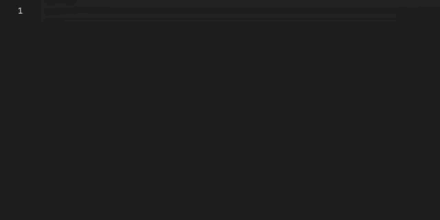

# AWS Amplify Visual Studio Code Extension

Code snippets and completion for the [AWS Amplify](https://aws-amplify.github.io/amplify-js) API.

## Installation

Visit [VS Code Marketplace](https://marketplace.visualstudio.com/items?itemName=aws-amplify.aws-amplify-vscode) and click "Install".

Alternatively, go to the _Extension Marketplace_ in VS Code and search for AWS Amplify. Click install on the extension with title "AWS Amplify API".

## Usage

In a JavaScript, TypeScript, or JSX file, start typing an AWS Amplify API command that has a corresponding snippet and choose the appropriate snippet by either clicking it or pressing "enter" or "tab" when the correct snippet is highlighted in the dropdown menu. You can scroll between snippets using the up and down arrow keys.

## Naming convention

The naming convention for code snippets is "Amplify " + action prefix. So, in the code editor, you can type:

```
Amplify Update User Attributes
```

to output the related code block:



The code blocks with the same name are displayed in their order, e.g. 3rd snippet for "Analytics Installation And Configuration" will have the prefix "Amplify Analytics Installation And Configuration 3".

Single word snippets (snippets that complete single words when clicked): https://github.com/aws-amplify/amplify-js/wiki/VS-Code-Snippet-Extension#single-word-snippet-documentation
